  

## 🛠 Tech Stack
  
### Languages

### Backend

### Frontend

### Cloud & DevOps

## 📂 Featured Projects

| 프로젝트 | 기간 | 역할 | 개요 |
|:---:|:---:|:---:|:---|
| **운명도 꿰어야 사랑이다** | 26.09 | PO · BE | 사주 궁합으로 인연을 이어주는 축제 한정 소개팅 서비스 · 누적 사용자 3500+ |
| **Wilson** | 26.06 ~ | PM · BE · App | 치매 당사자와 보호자를 함께 돌보는 음성 AI 플랫폼 |
| **Nexo** | 26.05 ~ | PO · SWE | 직접 만든 프록시 엔진으로 무중단 배포와 쉬운 라우팅 설정을 돕는 플랫폼 |
| **🏆 동데이** | 25.10 | Lead PM | 공연장-인디밴드를 잇는 예약 시스템 및 아카이빙 플랫폼 |
| **Dirvana** | 25.09 | BE Lead · FE | 동국대 2025 가을축제 공식 웹사이트 · 누적 사용자 8000+ |
| **🏆 Walking City** | 25.08 | Full-stack | 취향에 맞는 산책 코스를 추천해주는 서비스 |
| **[PromptPlace](https://www.promptplace.kr)** | 25.07 ~ | Full-stack | AI 프롬프트를 사고파는 마켓플레이스 · 운영 중 |

 

## 🏆 Highlights

| 시기 | 내용 |
|:---:|:---|
| 2026.08 | 🎤 **PyCon Seoul 2026** 세션 발표 — *Green CI / Red Production* |
| 2025.11 | 🥇 교내 창업동아리 데모데이 **대상** (동데이) |
| 2025.08 | 🏅 K-HTML 해커톤 **우수상** (Walking City) |

 

## 🏃 Activities

| 기간 | 활동 |
|:---:|:---:|
| 2026.09 ~ | 공공 AX 서포터즈 1기 |
| 2026.05 ~ | ASBG in DGU 1st General Member |
| 2026.01 ~ | 멋쟁이사자처럼 14기 백엔드 트랙장 |
| 2025.08 ~ 2026.02 | UMC 9th Web 파트 중앙운영진 수료 |
| 2025.03 ~ 2025.12 | 멋쟁이사자처럼 13기 백엔드 트랙 수료 |
| 2025.03 ~ 2025.08 | UMC 8th Web 파트 수료 |
| 2022.09 ~ 2023.02 | 교내 중앙봉사동아리 '길' 회장 |

 

  
  &nbsp;&nbsp;
  

